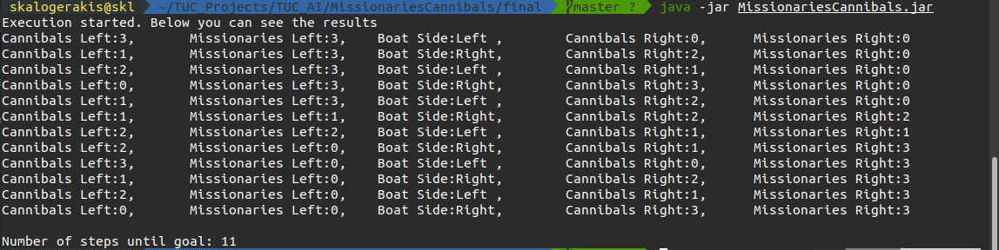

# Missionaries and Cannibals


My implementation of the problem missionaries and cannibals using Breadth First Search(BFS) algorithm.


# Execution Steps 


- Go to /final folder
- Simply execute java jar with file name **MissionariesCannibals**. For example execution in linux with the command 
```sh
$ java -jar MissionariesCannibals.jar
```

# Java Preresiquites

The project is expected to run for every version above Java 8. Project build environment


In my system the code was executed in the following enviroment and Java configurations
- Java version


- Javac version


# Expected Execution 




